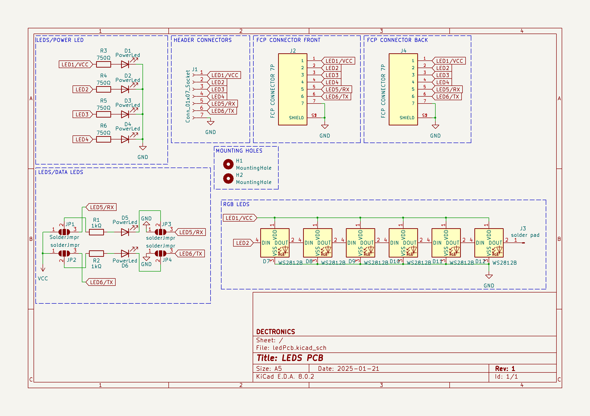
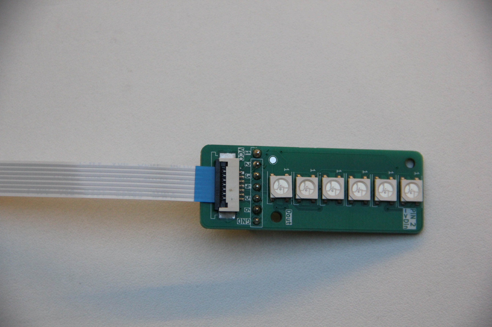
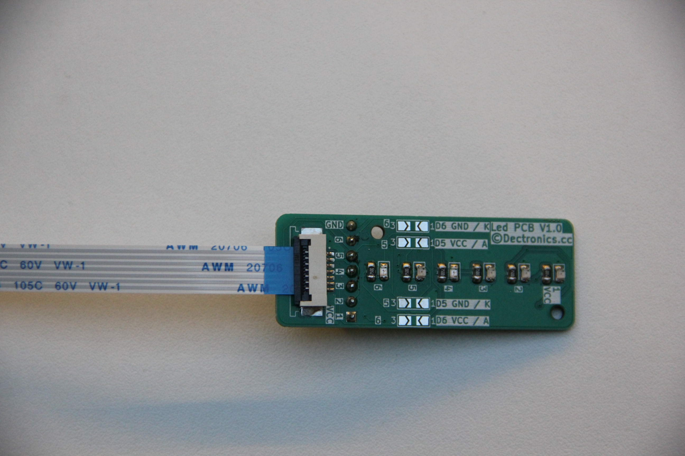
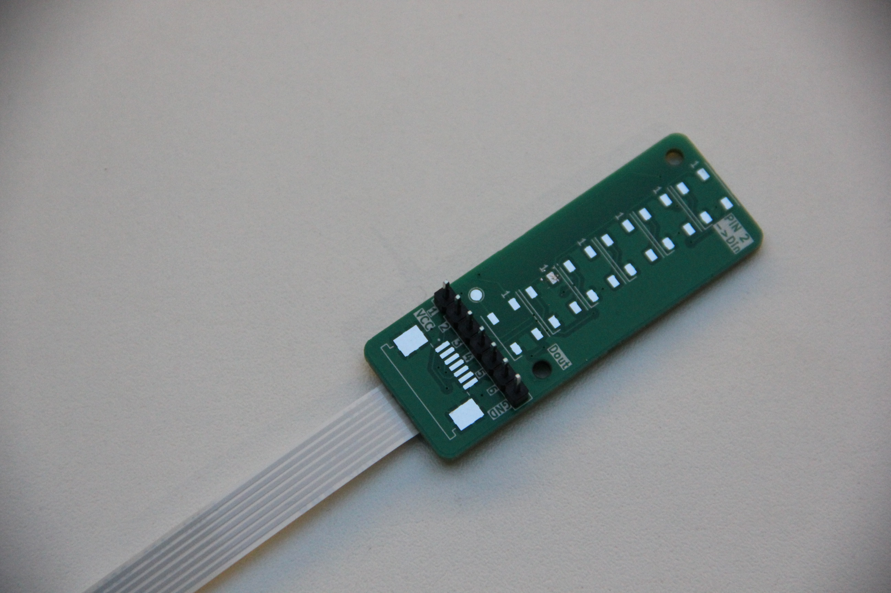

# LED PCB

The LED PCB is a versatile lighting interface board designed to connect standard LEDs and addressable WS2812B RGB LEDs to systems via FCP connectors or pin headers. It provides flexible soldering options to choose wich connection option you want to use.
## Overview

This PCB serves as a lighting expansion board that can be integrated with various systems through standardized connectors. It features both power indicator LEDs and a chain of WS2812B addressable RGB LEDs, making it suitable for status indication, ambient lighting, and visual feedback in electronic projects.

## Features

- **Power/Status LEDs**: 4 individual LEDs with current-limiting resistors
- **WS2812B Support**: Chain of 6 addressable RGB LEDs
- **Dual FCP Connectors**: Front and back connection options
- **Header Connectors**: Standard 2.54mm pin headers for breadboard compatibility
- **Flexible Soldering**: Multiple connection points for different configurations
- **Mounting Holes**: Two mounting holes for secure installation
## Hardware Schematic

## Assembled PCB

## Connector Pinout
### FCP Connector (J2/J4)

| Pin | Function |
| --- | -------- |
| 1   | LED1/VCC |
| 2   | LED2     |
| 3   | LED3     |
| 4   | LED4     |
| 5   | LED5/RX  |
| 6   | LED6/TX  |
| 7   | GND      |

### Header Connector (J1)

|Pin|Function|
|---|---|
|1|LED1/VCC|
|2|LED2|
|3|LED3|
|4|LED4|
|5|LED5/RX|
|6|LED6/TX|
|7|GND|

## Soldering Options

The PCB includes multiple solder jumpers (JP1-JP4) that allow you to configure the connections based on your specific requirements:

- **JP1/JP3**: Via these jumpers you can configure if you want to use it as an adressable led or to see the rx progress on the led
- **JP2/JP4**: Via these jumpers you can configure if you want to use it as an adressable led or to see the tx progress on the led

### Soldering Configurations:

You can choose to solder different components depending on your needs:

1. **Status LEDS**: Solder R3-R6 and D1-D4 for basic power/status indication
2. **RGB LEDS**: Solder the WS2812B LEDs (D7-D12) and appropriate jumpers
## Mounting

The PCB includes two mounting holes (H1 and H2) for secure installation using M3 screws.

## Usage Examples

### Status Indication

Use the individual LEDs (D1-D4) to indicate system status, power levels, or operational modes.

### Ambient Lighting

Program the WS2812B LEDs for decorative lighting effects, color-coded status information, or animations.

### Visual Feedback

Create visual feedback systems using the addressable RGB LEDs to indicate process states, alert conditions, or data visualization.
## Compatibility

This LED PCB is designed to work with:

- Systems using FCP connector standard
- Breadboard-compatible systems via pin headers
- Any microcontroller capable of driving WS2812B LEDs

© DECTRONICS
